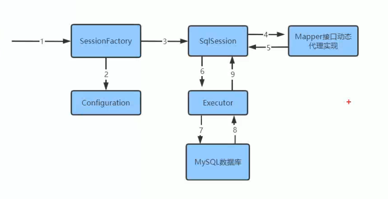

## mybatis执行的流程

## 思路

1. 读取xml配置文件的信息
2. 创建一个SqlSessionFactory，并解析mybatis-config.xml和xxMapper.xml的信息（简化了步骤，直接在解析过程中赋值了）
3. 将解析的结果封装到一个Configuration中，包括Environment，表示数据库的一些连接信息；
   和一个Map<String, MapperStatement>，其中key的表示是namespace+id，MapperStatement存储相关的sql信息
4. 调用openSession方法，其中SqlSession中包括前面解析的配置类和一个执行器Executor。
5. Executor可以通过DataSource进行数据库交互
6. 获取mapper的代理类
7. 调用查询方法，最终会调用Executor的方法，Executor的到参数，并获取响应的MapperStatement，执行完成之后，根据返回类型，使用反射将结果封装成响应的类型
